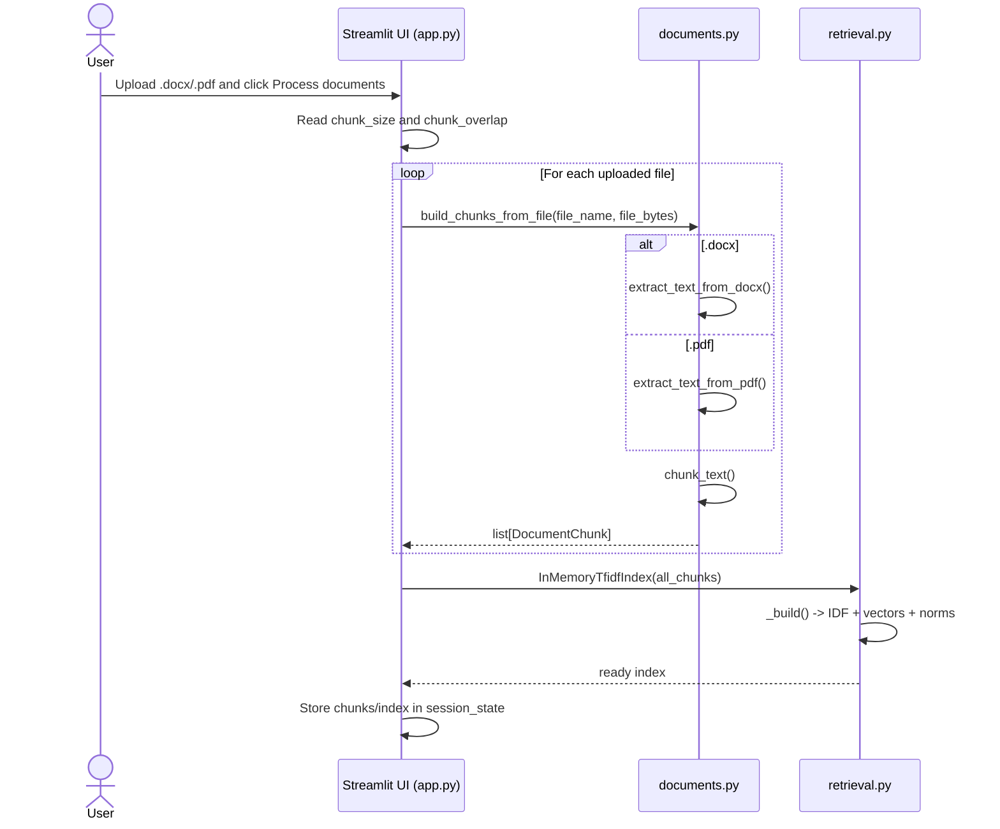
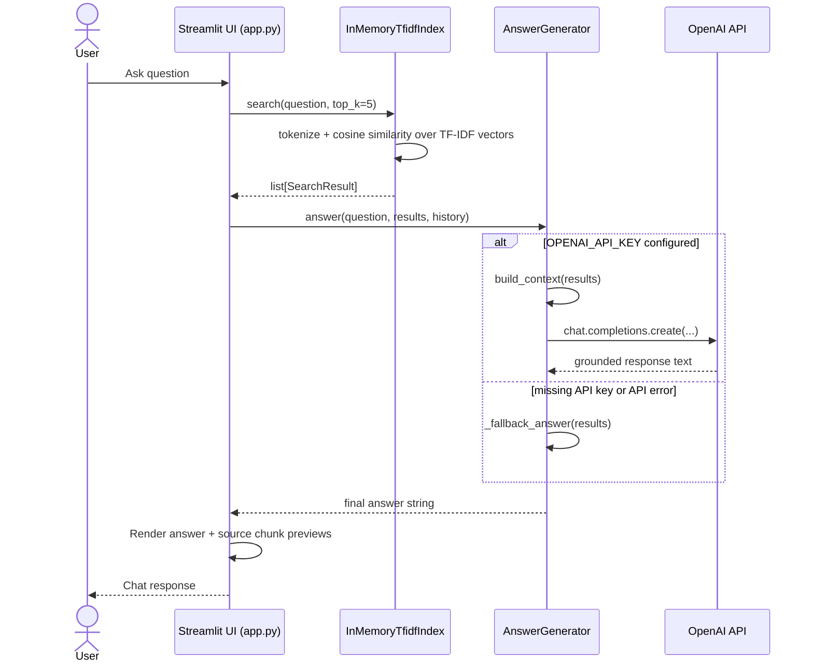
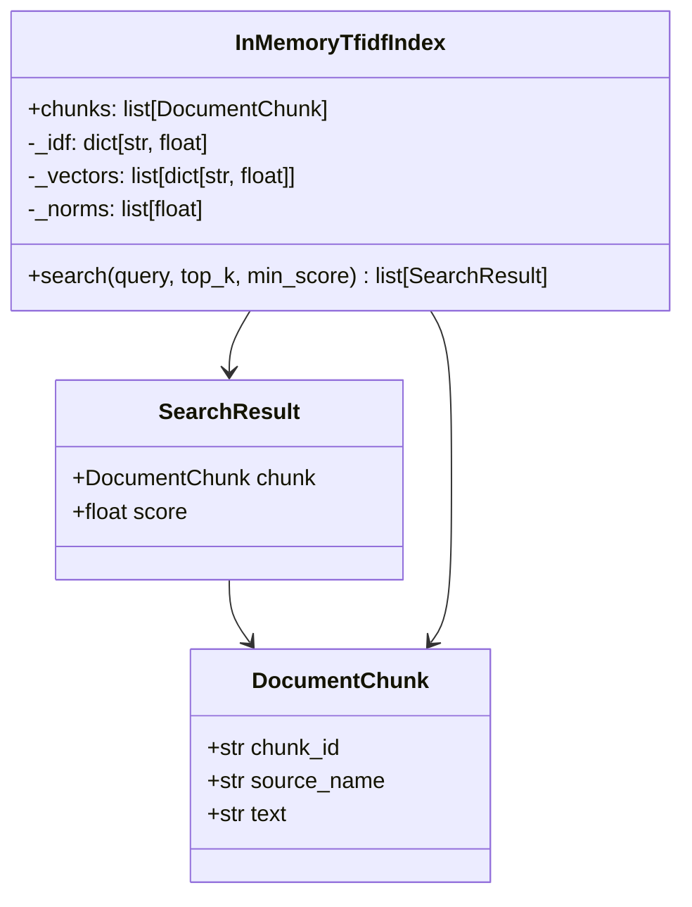

# Architecture and Runtime Flow

This document explains how the document chatbot works end to end.

## High-Level Architecture

The app uses a retrieval-augmented generation (RAG) pattern:

1. Parse uploaded files into plain text
2. Split text into chunks
3. Build an in-memory TF-IDF index over chunks
4. Retrieve top chunks for each question
5. Ask the LLM to answer using only those chunks

```mermaid
flowchart LR
    U[User] --> UI[Streamlit UI\napp.py]
    UI --> DOCS[Document parser/chunker\nchatbot/documents.py]
    DOCS --> IDX[In-memory TF-IDF index\nchatbot/retrieval.py]
    UI --> SEARCH[search(query)]
    SEARCH --> IDX
    SEARCH --> LLM[Answer generator\nchatbot/llm.py]
    LLM --> OPENAI[OpenAI Chat Completions API\noptional]
    LLM --> FALLBACK[Retrieval-only fallback\nno API key]
    LLM --> UI
    UI --> U
```

## Upload and Indexing Sequence

This runs when the user clicks **Process documents**.



## Question Answering Sequence

This runs when the user sends a chat message.



## Module Responsibilities

- `app.py`: Streamlit UI, session state, upload workflow, chat loop, and source rendering.
- `chatbot/documents.py`: File parsing (`.docx`, `.pdf`), text normalization, chunking, and `DocumentChunk` creation.
- `chatbot/retrieval.py`: Tokenization, TF-IDF vector build, cosine similarity search, and prompt context assembly.
- `chatbot/llm.py`: LLM orchestration, conversation history inclusion, and retrieval-only fallback mode.

## Core Data Structures



## Retrieval Details

`InMemoryTfidfIndex` uses standard TF-IDF weighting with cosine similarity:

- `idf(term) = log((N + 1) / (df + 1)) + 1`
- term frequency is normalized by the max term count within each chunk
- similarity is cosine between query vector and chunk vector
- results below `min_score` are filtered (default `0.05`)

## State and Lifecycle

The app stores runtime state in `st.session_state`:

- `chunks`: all parsed `DocumentChunk` objects from current uploads
- `index`: current `InMemoryTfidfIndex`
- `messages`: chat history for rendering and short conversational context
- `answer_generator`: configured `AnswerGenerator` instance

All state is in-memory. Restarting Streamlit clears indexed documents and chat history.

## Configuration

Environment variables loaded from `.env`:

- `OPENAI_API_KEY`: optional; enables full LLM answers
- `OPENAI_MODEL`: optional; defaults to `gpt-4o-mini`

If no API key is set, the chatbot still retrieves relevant chunks and returns excerpt-based fallback responses.

## Known Limitations

- PDF support is text extraction only; scanned/image PDFs need OCR.
- Index is in-memory (not persisted).
- Retrieval is lexical TF-IDF (not semantic embeddings).
- No authentication or per-user document isolation yet.

## Extension Points

- Add OCR for scanned PDFs (for example, `pytesseract` + `pdf2image`).
- Replace TF-IDF with embeddings + vector database.
- Persist per-document indexes to disk or external storage.
- Add citations with exact page/paragraph metadata.
- Add auth and multi-tenant storage for production use.
